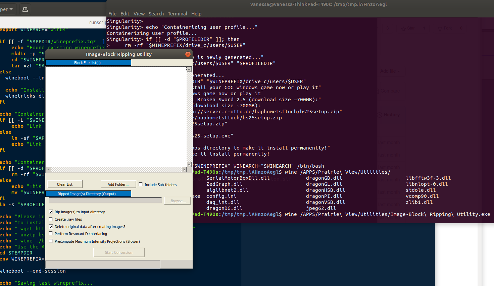

# two-photon

First, install the code.  You can use [GitHub desktop](https://desktop.github.com/), or use git on the command line:

```bash
git clone https://github.com/deisseroth-lab/two-photon.git
```

Next, install the environment.  You will need to install [conda](https://docs.conda.io/en/latest/) first.  Then
use the following command from within the directory where you installed the repo above.

```bash
conda env create -f environment.yml -n two-photon
```

To run the processing script, the environment needs to be activated:
```
conda activate two-photon
```

See the comments at the top of the [preprocess script](https://github.com/deisseroth-lab/two-photon/blob/master/process.py)
for examples of how to run the processing.

## Docker for ripping only

To build the docker container and tag it as `two-photon:latest`, use:

```bash
docker build -t two-photon .
```

Run the ripper using the following command, using a directory containin the *RAWDATA* and *FileList.txt files.

```bash
./docker_rip.sh /media/hdd0/two-photon/sample/overview-023
```

## Singularity for ripping only

To build the Singularity container, build the Docker container first:

```bash
docker build -t two-photon .
```

and then build the [Singularity recipe](singularity/Singularity) that has a custom entrypoint. 

```bash
sudo singularity build two-photon.sif singularity/Singularity
```

This works by way of creating a fresh wineprefix in /tmp (where we have write) and then
starting an interactive (bash) shell for the user to issue commands. If you want
to run the container interactively without using the [singularity_rip.sh](singularity_rip.sh)
script, you can do the following:

```bash
# create profiles directory to save profiles
mkdir -p profiles

# Run the container! Note that you can also build the container with any Windows
# applications already added (instead of bound)
singularity run \
    --bind "${PWD}/Prairie View":"/APPS/Prairie View/" \
    --bind ${PWD}/profiles:/PROFILES \
    two-photon.sif
```

This is going to set up wine, and then start a bash shell for you to work with. For example,
I could use wine to open up the .exe file:

```bash
wine /APPS/Prairie\ View/Utilities/Image-Block\ Ripping\ Utility.exe
```
to open up the Image Block Ripping Utility:



If you want to run the ripper, you can use the following command, using a directory containin the *RAWDATA* and *FileList.txt files.

**will update when have testing data**

_NB: Does not work_

```bash
./singularity_rip.sh /media/hdd0/two-photon/sample/overview-023
```
